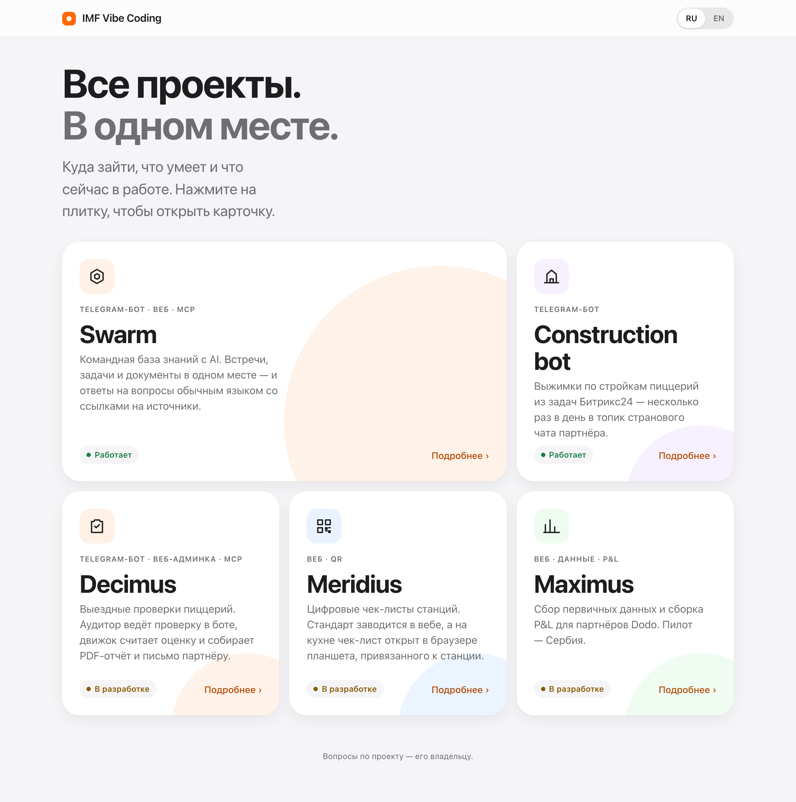
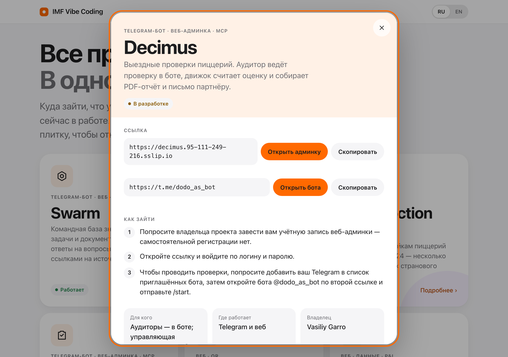
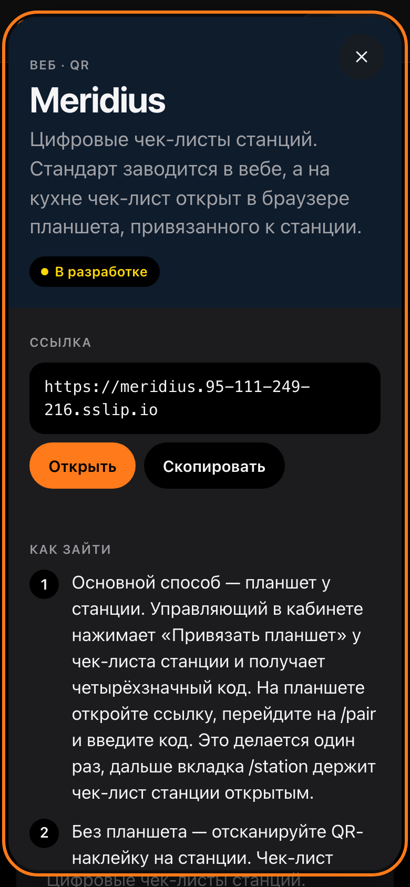

# IMF Vibe Coding — хаб проектов

**Сайт:** https://garrov.github.io/imf-vc/ · English: https://garrov.github.io/imf-vc/en/

Одна страница для коллег: какие проекты есть, куда по ним зайти, как получить
доступ и что сейчас в работе. Нажали на плитку — открылась карточка проекта
с актуальной ссылкой, шагами входа и планом. Сайт публичный, но скрыт от
поисковиков (`noindex`); секретов, паролей, токенов и данных партнёров на нём
нет и быть не должно.



## Для кого

Коллеги в Dodo, которым нужно попасть в проект или понять, что в нём
происходит. Владелец проектов — Vasiliy Garro.

## Что на экране

| Поверхность | Что показывает | Откуда данные |
|---|---|---|
| Плитки на главной | Название, тип, одна строка «что это», статус (работает / пилот / в разработке) | `src/content/projects/*.yaml` |
| Карточка проекта (`#slug`, например [`#decimus`](https://garrov.github.io/imf-vc/#decimus)) | Ссылка с кнопками «Открыть» и «Скопировать» (и вторая дверь, если есть, — например бот рядом с вебом), шаги входа, для кого, где работает, владелец, демо, репозиторий (ссылкой на GitHub, у закрытого — «Закрытый»), план проекта: сейчас в работе, дальше (ближайшие), выкачено за 30 дней | YAML проекта + Swarm (план — при открытии страницы) |
| Переключатель RU / EN | Русская версия — `/imf-vc/`, английская — `/imf-vc/en/` | Словари `src/i18n/` |

Если факта нет в источниках, в данных стоит `todo`, а сайт пишет
«Уточняется». Каждый `todo` — открытая задача в Issues с меткой `todo-data`.
Сейчас `todo` в данных нет: все факты найдены (28.09.2026).

<table><tr>
<td></td>
<td></td>
</tr></table>

## Как добавить проект

1. Создайте `src/content/projects/<slug>.yaml` по образцу соседних. Схема —
   `src/lib/schema.ts`. Все поля обязательны; тексты — на каждом языке
   (`ru`, `en`).
2. Каждый факт берите из источника (README, docs, deploy-доки проекта, карта
   хозяйства) и перечислите источники в `sources`. Чего нет — ставьте
   `{ todo: "вопрос владельцу" }` и заведите issue с меткой `todo-data`.
3. `repo_public` — по факту `gh repo view GarroV/<repo> --json visibility`:
   у приватного репозитория карточка ссылку не показывает (коллега без
   доступа получит 404). `extra_links` — вторые двери проекта (бот рядом с
   вебом) с подписью на каждом языке; нет — `[]`.
4. Если у проекта есть подпроект на доске «Vibe Coding» в Swarm — впишите его
   UUID в `swarm_project_id`; нет доски — `null`, плана в карточке не будет.
5. `npm run verify`. Сборка падает, если поле пропущено или текст есть не на
   всех языках — так и задумано.
6. Пересоберите скриншоты (`npm run screens`) и обновите дату в реестре ниже.

Плитки идут по `order`; `size: lg` занимает 4 из 6 колонок, `sm` — 2.
Каждый ряд должен складываться в 6: `lg` + `sm` или три `sm`. Сейчас пять
проектов: Decimus (`lg`) + Meridius в первом ряду, Maximus, Construction bot
и Swarm (все `sm`) во втором. Дыру в сетке ловит e2e «bento без дыр».

Ссылка с ключом в адресе (демо Maximus и Swarm) — задуманный вход для показа:
ключ там не секрет, а защита от случайных прохожих и поисковиков, данные
в демо выдуманные. Настоящих паролей в данных нет и быть не должно.

## Откуда берётся план

Страница при открытии идёт в публичную выдачу Swarm:

```
GET https://vbqglndbxkpmreccpqmr.supabase.co/functions/v1/swarm-api/public/roadmap/d8299ea3-6a8f-4e57-bbfb-4a9b0a53aea9
```

Это доска «Vibe Coding»; её подпроекты — проекты хаба. Без авторизации и
без токенов — решение владельца. Договор выдачи — [`docs/roadmap-contract.md`](docs/roadmap-contract.md).
Какие задачи попадают в план, решается в Swarm: у задачи есть флаг
`hidden_from_hub`, у доски — `public_roadmap`.

Сайт проверяет ответ целиком. Сеть упала, ответ не 200, не JSON или не по
договору — на месте плана надпись «План временно недоступен», остальная
страница работает. **Сейчас выдача ещё не выкачена** (GarroV/Swarm-brain#562),
поэтому на живом сайте видна именно эта надпись.

Адрес можно подменить при сборке переменной `PUBLIC_ROADMAP_URL`. В `npm run dev`
без неё план берётся из фикстуры `tests/fixtures/roadmap.ts`; в прод-сборку
фикстура не попадает.

## Разработка

```bash
npm ci
npm run dev             # http://localhost:4321/imf-vc/, план из фикстуры
npm run verify          # astro check + сборка + e2e на Playwright
npm run check:negative  # ломает копию проекта и требует, чтобы проверки упали
npm run screens         # пересъёмка скриншотов для README
npm run smoke:live      # смоук живого сайта на Pages с настоящей выдачей Swarm
```

Стек: Astro 7, статическая сборка, content collection с zod-схемой,
встроенный i18n-роутинг Astro (`ru` по умолчанию без префикса, `en` под
`/en/`), CSP через `security.csp` Astro. Шрифт системный (SF на Apple).

**E2E** (`tests/e2e/`) гоняют прод-сборку через `astro preview`, на десктопе и
телефоне. Запрос к Swarm перехватывается: отвечает фикстура или имитация
сбоя (сеть, 500, 404, битый JSON, ответ не по договору). Проверяется:
плиток столько, сколько проектов, bento без дыр, карточка открывается и
показывает ссылку, вторая ссылка (бот), закрытый репозиторий без ссылки,
прямая ссылка на карточку, RU/EN, «уточняется» не осталось, группы плана и окно 30 дней, отсутствие
горизонтального скролла на 320–1440, reduced-motion, клавиатура, отсутствие
ошибок в консоли и нарушений CSP.

**Проверка проверок** (`tools/negative-check.mjs`) убирает обработку ошибки на
странице, пробрасывает сбой сети, отключает сверку с договором, показывает
ссылку на приватный репозиторий, выкидывает
поле и язык из YAML — и падает, если хоть одна проверка осталась зелёной.

**Новый язык**: код в `src/i18n/locales.mjs`, словарь `src/i18n/<код>.ts`
(тип `Dict` не даст пропустить ключ), строка в `DICTS` в `src/i18n/index.ts`
и тексты в YAML проектов — сборка упадёт, пока их нет.

## Публикация

GitHub Actions (`.github/workflows/pages.yml`): на каждый пуш и PR — проверка
типов, e2e и проверка проверок; на `main` после них — сборка
`withastro/action` и деплой на GitHub Pages. После деплоя — `npm run smoke:live`:
плиток столько, сколько YAML в `src/content/projects`, карточка со ссылкой, план загрузился или честно сказал «недоступен»,
в консоли нет ошибок и нарушений CSP. Репозиторий публичный
осознанно: на бесплатном тарифе Pages из приватного репозитория недоступны, а
сайт и так публичный.

## Реестр материалов

Материалы, которые описывают продукт человеку. Изменили экран — пересняли
скриншоты (`npm run screens`) и обновили дату сверки.

| Материал | Где | Сверено с продуктом |
|---|---|---|
| README (этот файл) | `README.md` | 28.09.2026 |
| Скриншоты: главная светлая / тёмная / EN, карточка, план в карточке, телефон, «план недоступен» | `docs/screens/*.png` | 29.09.2026 |
| Утверждённый макет (визуальный эталон, данные выдуманы) | `docs/mockup.html` | 28.09.2026 |
| Договор выдачи плана | `docs/roadmap-contract.md` | 28.09.2026 |

Решения владельца по продукту — [`docs/decisions.md`](docs/decisions.md).
Беклог — [Issues](https://github.com/GarroV/imf-vc/issues).
